# css-to-the-rescue
[uitleg over de opdracht]

## Idee

## Schetsen

## Logs
### 04-03-2024

Vandaag ben ik begonnen aan het experimenteren met de elementen die ik wil toepassen op mijn pagina. De elementen die ik heb gerealiseerd zijn:

- Tempo slider
- Muziek starten
- Draaiknop voor low freq

Dit is voor nu nog alleen puur experimenteren en de elementen werkend krijgen a.d.h.v. de JS sliders en CSS


Het geen waar ik nu tegenaan loop is dat de muziek wel gestart kan worden a.d.h.v. de display v/d embed op block zetten, waardoor de audio automatisch wordt gestart, maar dat ik de muziek niet kan stoppen a.d.h.v. display none. Hier moet ik nog naar kijken, maar het is niet heel belangrijk dat er muziek wordt afgespeeld, aangezien wat ik wil maken alleen grafisch/visueel is.

### 05-03-2024

Vandaag ben ik begonnen met het kunnen veranderen/vervangen van tekst a.d.h.v. CSS. Dit heb ik wel werkend gekregen a.d.h.v. de teksten in kwestie een ID te geven, waarbij als er een bepaalde radio button wordt geselecteerd, de bijbehorende tekst op de plaats van ‘None’ wordt geplaatst. Hiervoor heb ik gebruik gemaakt van display: none en display: inline.

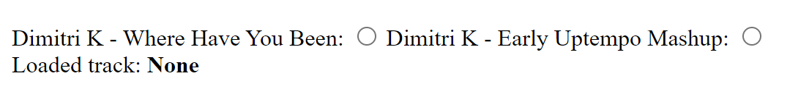

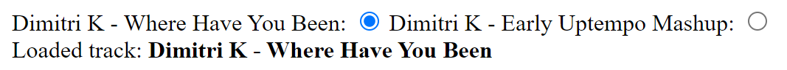

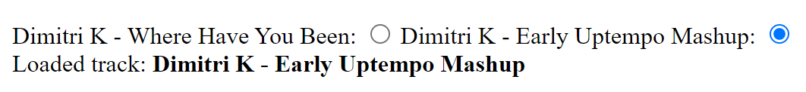

Dit idee wil ik verder uit gaan werken om zo een track te kunnen selecteren die op een channel wordt geplaatst met de waveform, titel en cover art. Dit zal hard coded zijn, aangezine ik geen JS kan gebruiken om elementen te vervangen voor iets anders. Er zal gebruik worden gemaakt van display: none en display: block.

Verder wil ik nog de ID’s vervangen voor een semantische codering, alleen moet ik hiermee nog puzzelen.

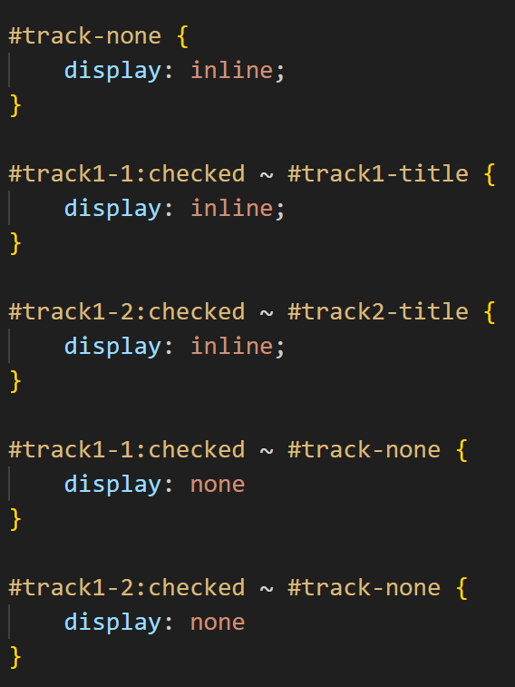

Ik heb nu in ieder geval gebruik gemaakt van nth-of-type() om een specifiek element te kunnen stylen. Dit werkt momenteel nog alleen met het element waar None in staat.

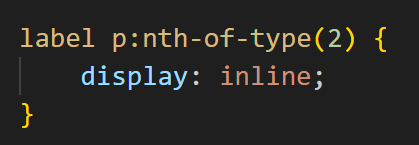

Nu werkt het zonder IDs:

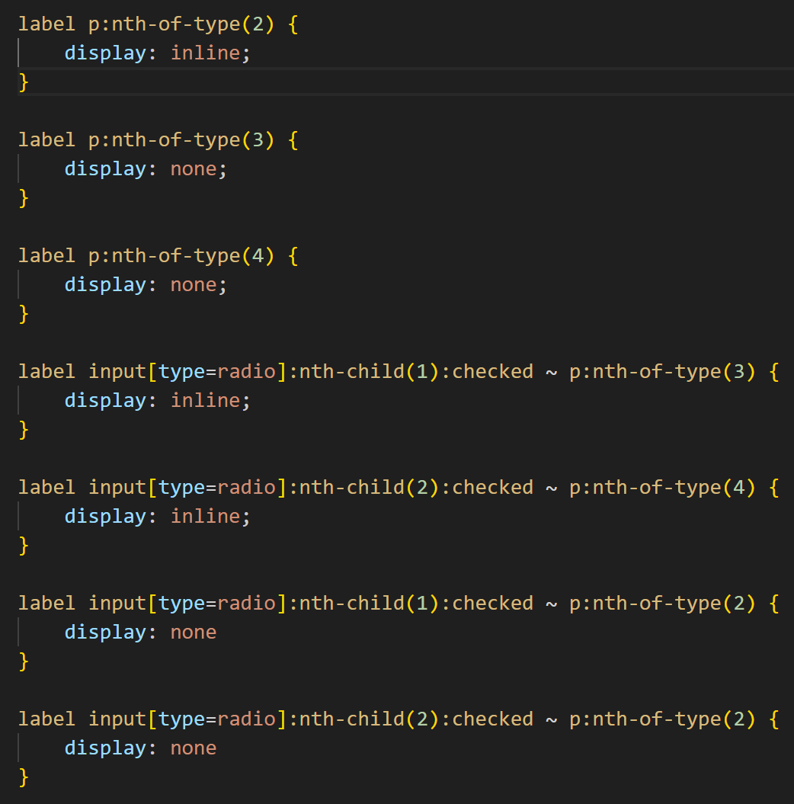

De volgende layout is nodig om het p element te selecteren waarin de tekst ‘None’ staat: 

- label p:nth-of-type(2)

De volgende layout is nodig om het p element te veranderen op basis van een specifieke radio button

- label input[type=radio]:nth-of-type(1):checked ~ p:nth-of-type(3)

De reden dat bij de 2e layout geen label nodig is voor p is, omdat de input en de p in dezelfde label zitten en dus siblings van elkaar zijn. Er staat als het ware ‘van de input, dat in een label voorkomt, waarvan het type radio is, pak daar het 1e element van dat je tegen komt en wanneer deze checked is, pak dan het 3e element van het type p dat je tegen komt’.

### 08-03-2024

Ik heb vandaag de styling gedaan voor de ‘thumb’ van de sliders, om zo het meer effect te geven. Dit ga ik doen a.d.h.v. de volgende guide [<link>](https://css-tricks.com/styling-cross-browser-compatible-range-inputs-css/). Ik wil ook de ‘achtergrond’ van de slider stylen naar hoe het er op een draaitafel uitziet, met de lijnen die verticaal of horizontaal staan. 

Zo zien de sliders er uit met de volledige CSS uit de guide:

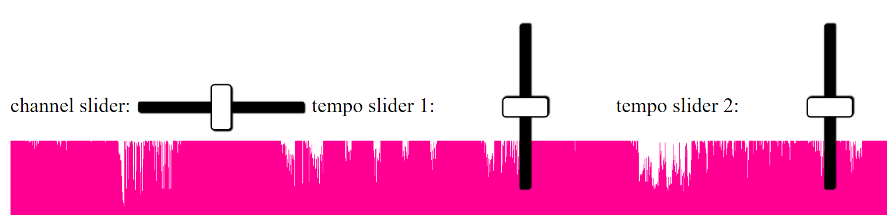

Zo zien de sliders er uit met mijn eigen geschreven CSS:

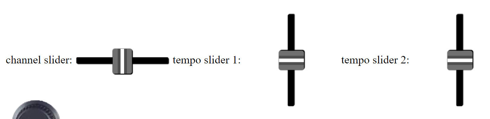

Hiervoor heb ik in Adobe XD een element gemaakt, die ik vervolgens exporteer naar SVG. Er SVG staat als code in de HTML.

Ook heb ik voor de draaiknop een element in Adobe XD gemaakt, geëxporteerd naar SVG code en dit in de HTML gezet.

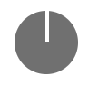

Voor de frequentie knoppen heb ik gelijk een grid aangemaakt

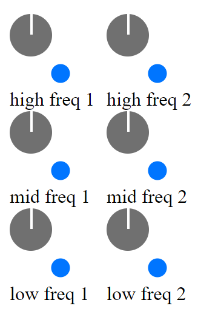

Ik heb een begin gemaakt aan een equializer waarbij de waarde van de positie kan veranderen op basis van de waarde dat voor komt in --high-freq-1. Echter werkt dit nog niet helemaal, omdat de waardes die nodig zijn voor het laten draaien van de knop anders zijn dan de waardes om een puntje omhoog en omlaag te laten gaan. Hier zal ik nog naar moeten kijken, maar voor nu werkt het volgende een soort van

```jsx
:root {
    --high-freq-1-edit: max(0.44, min(0.56, var(--high-freq-1)));
}

#Ellipse_3 {
    transform: translate(916px, calc(728px * calc(var(--high-freq-1-edit) + .5)));
}
```

De slider begint bij .5, en als de waarde van de slider tussen de 0.44 en 0.56 is, zal het puntje mee bewegen. Natuurlijk zou ik willen dat het puntje meebeweegt als de waarde tussen .1 en .9 is, maar ik heb dit nog niet mogelijk gekregen. Misschien zou ik moeten kijken of ik iets met percentages kan doen?

### 11-03-2024

Vandaag heb ik de layout opgesteld voor de mobile view. Hierbij heb ik elementen gepakt die ik al had gemaakt, zoals de sliders en draaiknoppen. Om alles in te delen heb ik gebruik gemaakt van een grid, met op dit moment 9 kolommen en 16 rijen. De reden hierachter is dat ik door het hebben van veel rijen en kolommen ik de elementen van de draaitafel, die allemaal verschillende groottes hebben, beter in kan delen voor de mobile view. 

Elementen die ik nog heb toegevoegd:

- Start/pauze knop
- Cue knop
- Menuknop voor tracks per channel (alleen voor mobile view)
- Nieuwe audio waveforms (.svg bestanden)

Zonder grid:


Met grid:

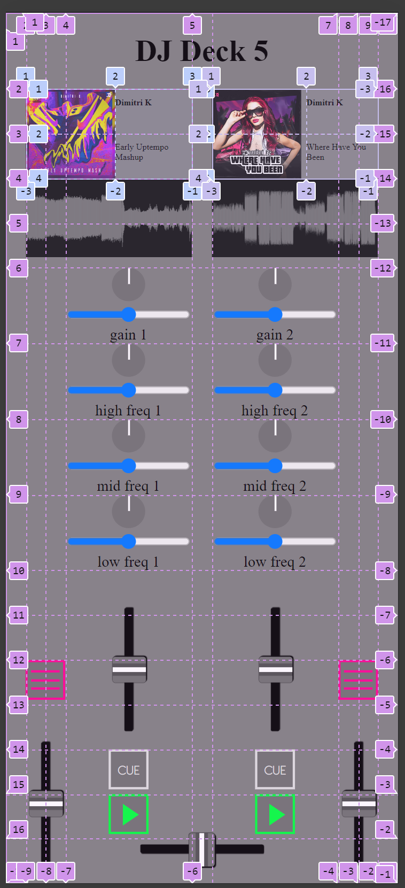

Waar ik tegen aan loop is natuurlijk het gebrek aan ruimte, wat erg te zien is bij de cover art, artiest en titel van de liedjes. Het lijkt allemaal erg klein en de tekst is waarschijnlijk ook voor de meesten onleesbaar. Hier moet ik nog even wat op bedenken. Verder loop ik er tegen aan dat ik twee menutjes wil maken waar tracks in staan, één menu voor channel 1 en één menu voor channel 2. Het probleem is echter dat ik niet wil dat ze beiden tegelijk geopend kunnen worden, omdat het anders een warboel kan worden. Nou heb ik het wel voor elkaar gekregen dat als het menu voor channel 1 is geopend, de menuknop voor channel 2 op display: none; komt te staan. Maar dit kan ik tot op heden niet andersom maken vanwege de volgorde van de HTML. Ik heb namelijk de volgende code gebruikt:

```css

#trackMenuButton-1:has(input[type=checkbox]:checked) + #trackMenuButton-2:has(input[type=checkbox]) {
    display: none;
}
```

Het kan zijn dat ik het weghalen van de menu knop van channel 2 weglaat, omdat het naar mijn mening het design minder goed maakt wanneer er maar één van de twee knoppen kan verdwijnen.

### 16-03-2024

Ik heb het menu voor de tracks werkend gekregen.

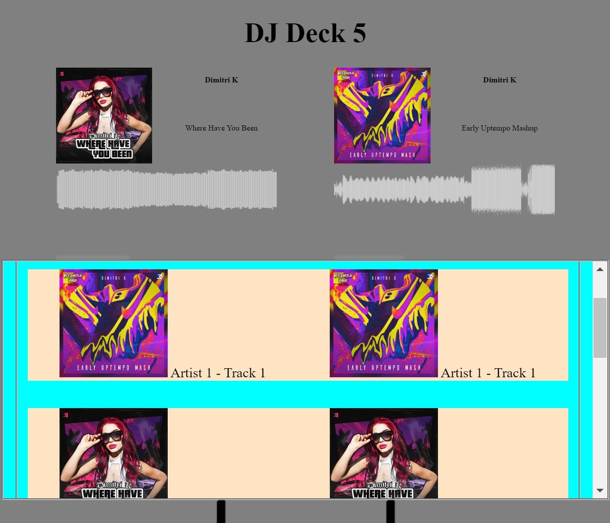

Hiervoor heb ik het volgende CSS formaat gebruikt:

```css
fieldset:has(fieldset label:nth-of-type(1) input[type="radio"]:checked) ~ fieldset:nth-of-type(2) {
    display: grid;
}
```

Wanneer er een track aan de linkerkant wordt geselecteerd, zal de track ‘geplaatst’ worden in de DJ deck en is deze klaar om ‘af te spelen’. Dit geldt ook voor de tracks aan de rechterkant. De linkerkant staat voor channel 1 en de rechter voor channel 2. 

Qua styling moet er nog een hoop gedaan worden, maar ik ben nu alweer een stap verder met de functionaliteiten. 

Ook heb ik nieuwe waveforms gemaakt, die transparant zijn. Dit zijn ook PNGs en kunnen beter gemanipuleerd worden qua hoogte en breedte dan SVG bestanden. Ik heb de hoogte van de waveform gekoppeld aan de volume slider en de breedte van de waveform aan de tempo slider. De tempo slider heeft nieuwe waardes gekregen om het effect van versnellen nog groter te maken. Nu ik ook de freqentie knoppen en de gain knoppen aan de waveforms heb gekoppeld kan de hoogte al helemaal goed gemanipuleerd worden

[alles max]

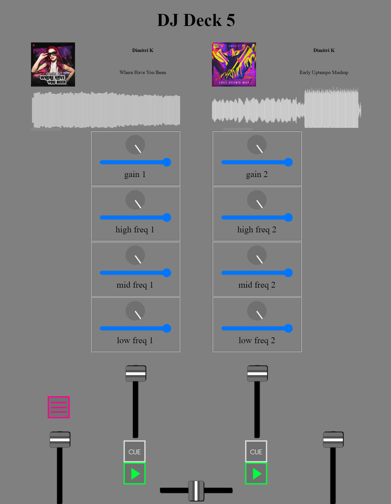

[alles min]


[standaard]

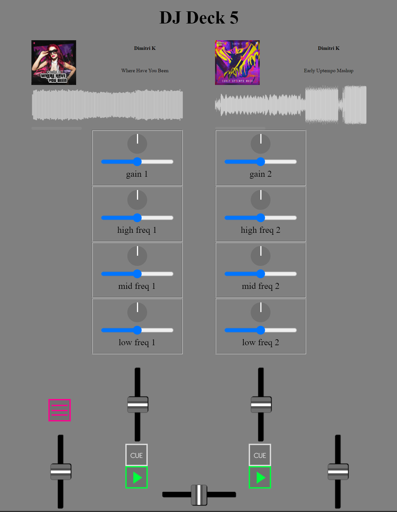

om de rekenen hoe hoog de waveform moet zijn wordt de volgende berekening gebruikt (natuurlijk geldt dit ook voor beide channels)

```css
height: calc(60px * calc(var(--volume1) + calc(var(--low-freq-1) * 0.05) + calc(var(--mid-freq-1) * 0.05) + calc(var(--high-freq-1) * 0.05) + calc(var(--gain-1) * 0.2)));
```

Om de effecten na te bootsen heb ik ervoor gekozen om de volume slider en de gain knop de groottste veranderingen te laten maken en de freqentie knoppen wat minder.

### 18-03-2024

Nieuwe grid layout:

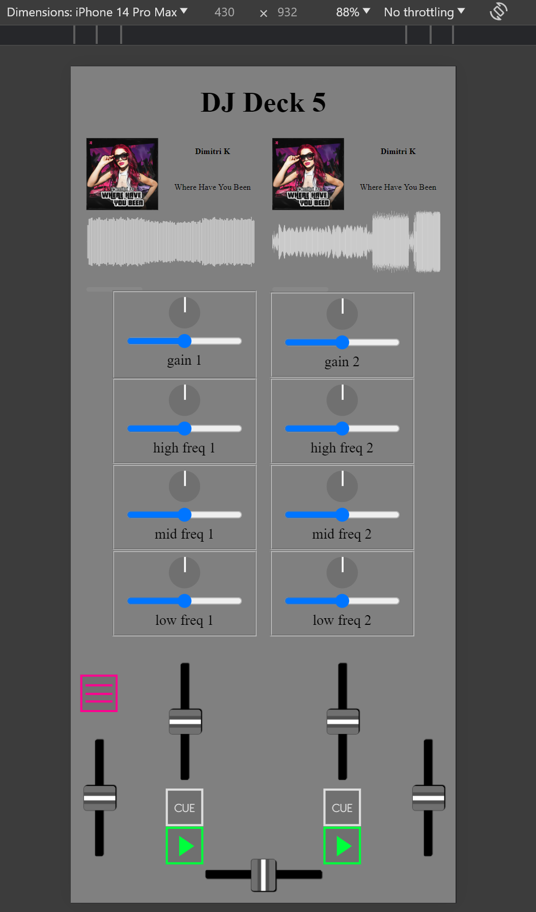

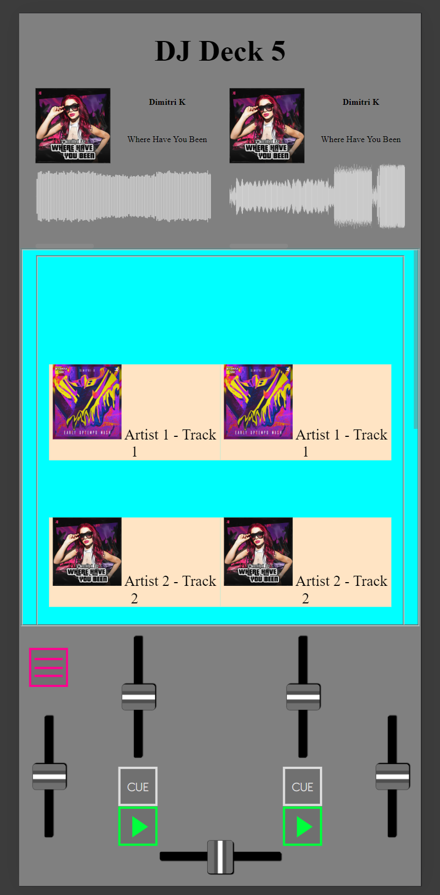

Alles staat nu vast, wat het resultaat heeft dat als het menu wordt geopend, niet alle elementen alle kanten op vliegen. Dit heb ik gedaan door i.p.v. overal 1fr te gebruiken, de kolommen en rijen specifiekere waardes te geven. Nu moet ik nog het trackmenu beter maken. Daarna is de mobile view als het ware af en kan ik een begin maken aan de web view.

De draaitafel ziet er nu als volgt uit:

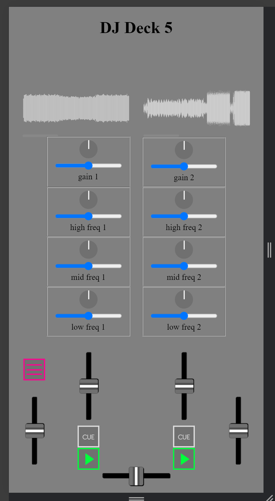

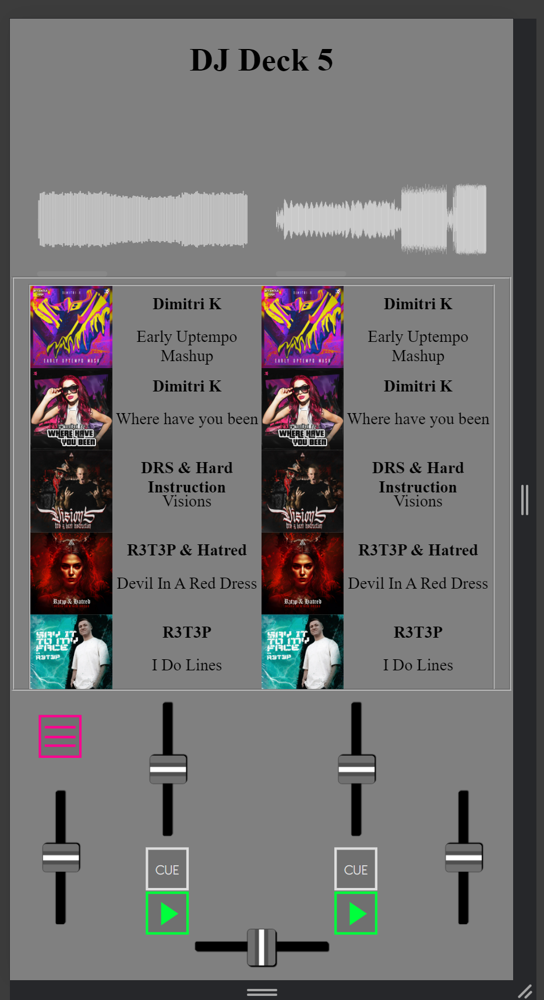

Ik heb het grid aangepast, zodat bepaalde elementen een vaste waarde hebben, zoals het de tracks, waveforms, de draaiknoppen en het menu. Hierdoor verandert er geen één positie wanneer het menu wordt geopend en ziet het er beter uit. Ik heb ook extra liedjes toegevoegd, die elk in het bijbehorende channel kunnen worden geplaatst.

Ik heb nu per liedje de waveform ‘meegegeven’. Ik heb hiervoor het stukje code dat gebruikt wordt om de tracks in de channels te zetten gekopiëerd en geplakt, met alleen andere waardes bij de fieldset.

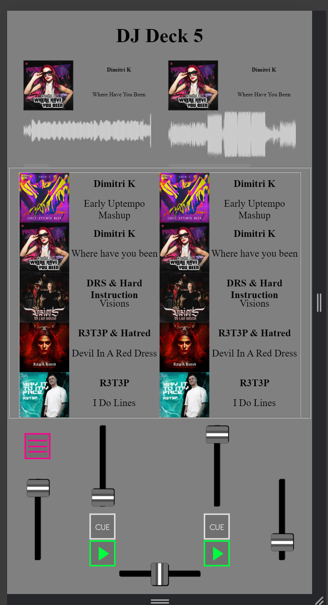

code voor het ‘inladen’ van een liedje:

```css
fieldset:has(fieldset label:nth-of-type(1) input[type="radio"]:checked) ~ fieldset:nth-of-type(2) {
    display: grid;
}
```

code voor het ‘inladen’ van het bijbehorende waveform:

```css
fieldset:has(fieldset label:nth-of-type(1) input[type="radio"]:checked) ~ fieldset:nth-of-type(18) {
    display: grid;
}
```

De img moet in een fieldset staan om het scrollbaar te maken en voor de juiste positie wat tevens ook als ‘viewbox’ wordt gebruikt.

Alle waveforms toegevoegd en werkend met de radio buttons in het menu:

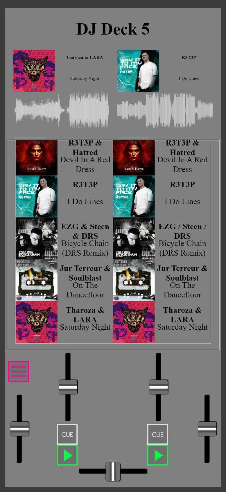