# css-to-the-rescue
Voor CSS To The Rescue staat CSS in het belang voor het maken van een website. De meest belangrijke voorwaarde voor de opdracht is dat er GEEN gebruik mag worden gemaakt van JavaScript, behalve het aangeleverde script van Sanne om sliders te kunnen gebruiken.

## Idee
Het idee dat ik heb bedacht voor deze opdracht is om een draaitafel dat DJ's gebruiken na te maken. Hiervoor heb ik het volgende voorbeeld gepakt, met daarbij gemaakte schetsen:


### Voorbeeld
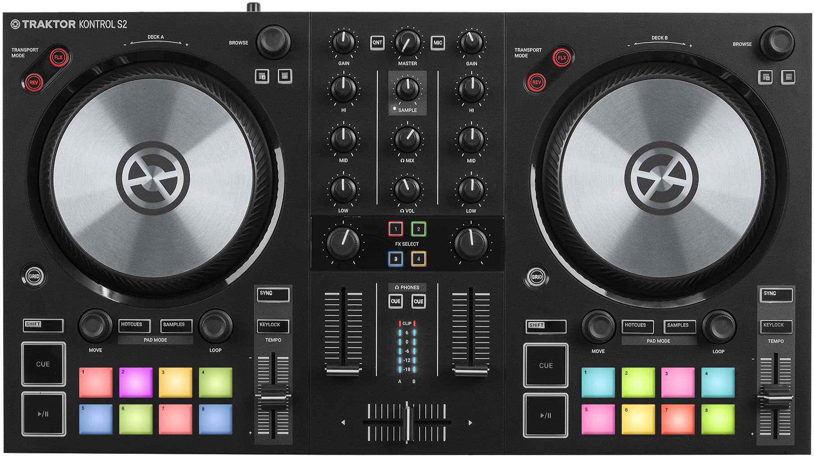

### Schetsen
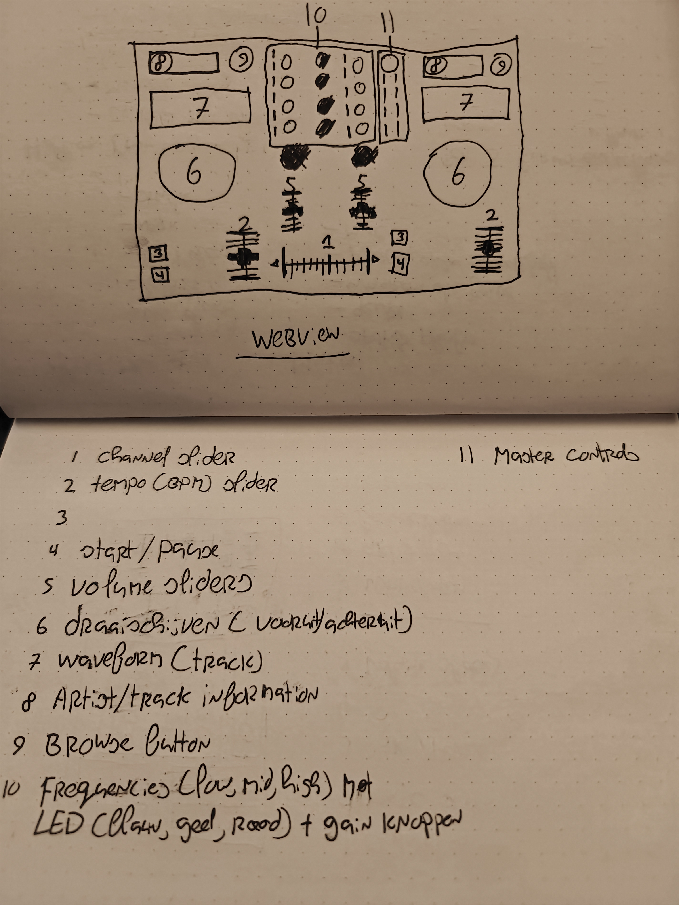
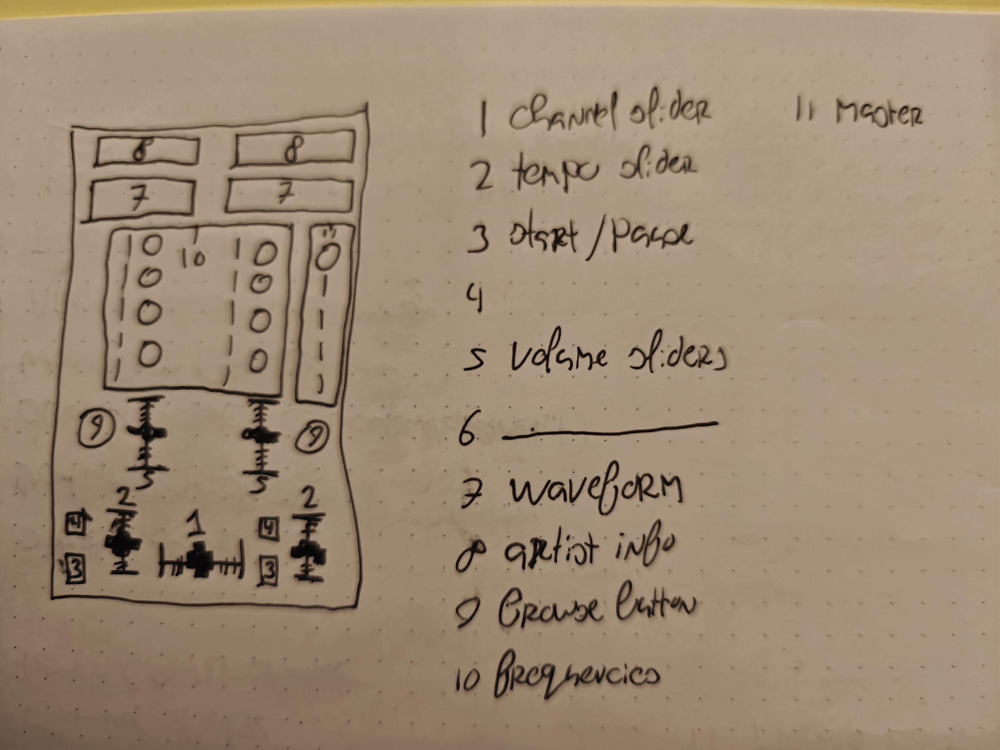
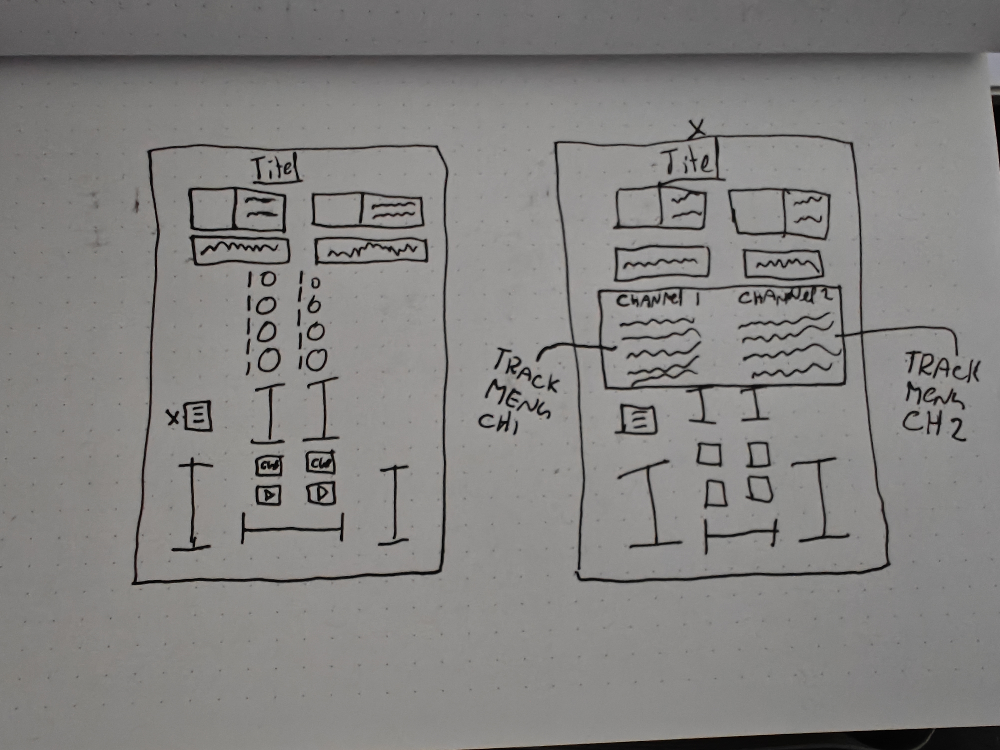


## Eindevaluatie

Om gelijk met de deur in huis te vallen, ik heb super veel geleerd van het maken van deze opdracht en heb er veel plezier in gehad (als dingen niet meewerkten was het plezier iets minder :P). Voorgaand aan de opdracht had ik het idee bedacht om een draaitafel na te maken, maar verloor ik al snel de hoop, omdat het mij onmogelijk leek om zoiets in alleen CSS na te maken. Toch ben ik gaan proberen een draaitafel na te maken. Hiervoor wilde ik eerst de basis functionaliteiten van een draaitafel werkend hebben, zoals de draaiknoppen, een soort menu om liedjes te kunnen selecteren en de sliders. 

Dit ben ik vervolgens gaan uitwerken door deze elementen eerst in een grid te plaatsen en deze een positie in het grid te geven. Hiervoor heb ik bij bepaalde onderdelen in het grid nog een grid gebruikt, bijvoorbeeld voor de groepering van de cover art, artiest en naam van het liedje.

Dit was de allereerste keer dat ik met grid heb gewerkt en ik ben er helemaal fan van geworden. Ik zie nu de meerwaarde in van het gebruik maken van grid om een webpagina in te kunnen delen.

Vervolgens ben ik verder gaan werken aan het menu, want eerst had ik alleen twee radio buttons die iets lieten veranderen. Het menu zou 8 liedjes bevatten, die per channel (er zijn twee channels) geplaatst kunnen worden. Hiervoor zou ik 16 radio buttons moeten gebruiken, die allemaal gebruik maken van :has om een liedje 'in te laden'. Net als dat ik nog nooit met grid heb gewerkt, had ik nog nooit met :has gewerkt. Hier was ik wel kort op vastgelopen, omdat ik nog niet goed begreep hoe :has goed gebruikt kon worden i.c.m. CSS nesting. Uiteindelijk kwam ik erachter dat :has gebruikt kan worden om bijvoorbeeld main:has(fieldset fieldset label input([type="radio"]):checked) te kunnen gebruiken. Hiervoor had ik nog tussen label en input een :has staan, waardoor het niet werkte. Door :has zo te gebruiken ben ik de waarde van :has gaan gebruiken en net zoals bij grid ben ik helemaal overtuigd van hoe handig :has kan zijn.

Bij het maken van het menu had ik achteraf gezien beter li en ul kunnen gebruiken dan een grid, omdat ik nu héééél veel regels code heb voor het grid, terwijl dit prima met een paar regels zou hebben gekund als ik li en ul zou hebben gebruikt voor de positionering van de groepen in het menu. 

Uiteindelijk heb ik het design afgerond en is het eindresultaat het volgende geworden:

### Web view

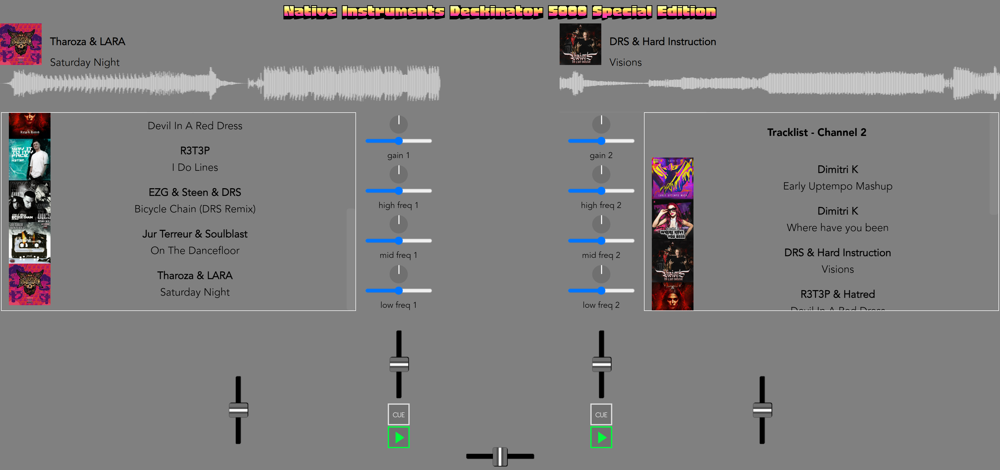

### Mobile view (menu dicht)

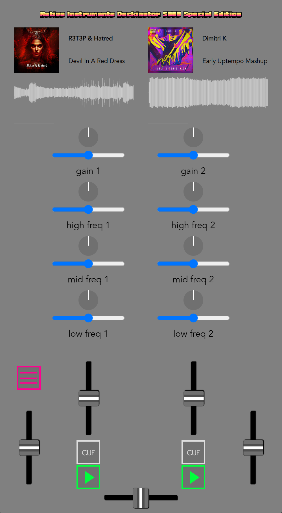

### Mobile view (menu open)

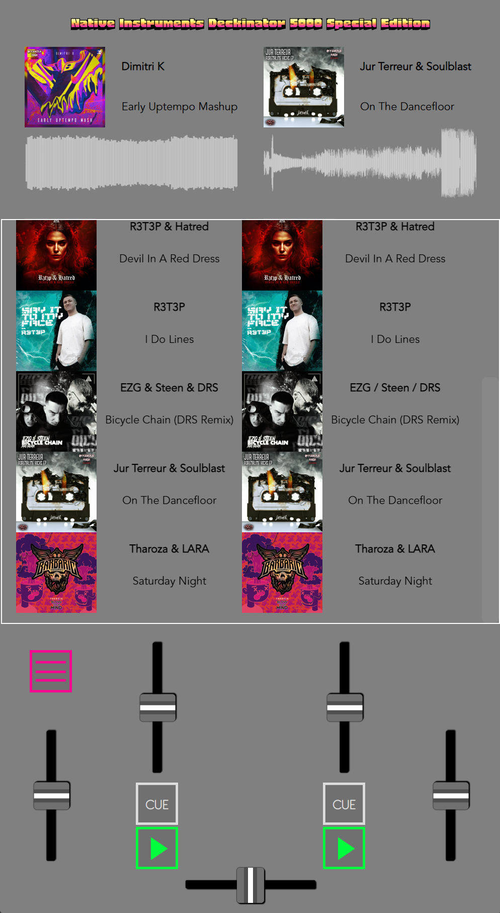

### Concreet de onderwerpen die ik tijdens het maken van de opdracht heb geleerd:

- CSS nesting
- :has()
- display: grid;
- SVG elementen gebruiken
- checkbox:checked
- font-size met clamp
- Manipuleren van elementen a.d.h.v. sliders

### Wat neem ik mee naar/wat zou ik beter willen doen voor een volgende opdracht?
- Schets maken waarin alle HTML elementen worden ontleden, om zo een goed beeld te schetsen van hoe de HTML-structuur eruit komt te zien.
- Eerst de vaste HTML-structuur maken, vervolgens aan de CSS beginnen en als ik nog elementen in de HTML mis, zoals voor afbeeldingen, een div of section gebruiken.
- De juiste HTML elementen gebruiken voor het juiste doeleind (geen fieldset voor een afbeelding bijvoorbeeld)
- Mooiere en compactere code schrijven.
- Geen herhalende waardes toewijzen aan de elementen in CSS, maar terugkerende waardes in een aparte class zetten.

## Logs
### 04-03-2024

Vandaag ben ik begonnen aan het experimenteren met de elementen die ik wil toepassen op mijn pagina. De elementen die ik heb gerealiseerd zijn:

- Tempo slider
- Muziek starten
- Draaiknop voor low freq

Dit is voor nu nog alleen puur experimenteren en de elementen werkend krijgen a.d.h.v. de JS sliders en CSS

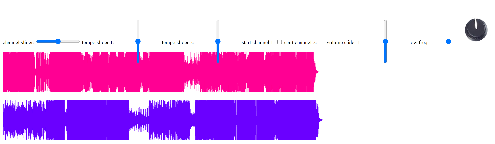

Het geen waar ik nu tegenaan loop is dat de muziek wel gestart kan worden a.d.h.v. de display v/d embed op block zetten, waardoor de audio automatisch wordt gestart, maar dat ik de muziek niet kan stoppen a.d.h.v. display none. Hier moet ik nog naar kijken, maar het is niet heel belangrijk dat er muziek wordt afgespeeld, aangezien wat ik wil maken alleen grafisch/visueel is.

### 05-03-2024

Vandaag ben ik begonnen met het kunnen veranderen/vervangen van tekst a.d.h.v. CSS. Dit heb ik wel werkend gekregen a.d.h.v. de teksten in kwestie een ID te geven, waarbij als er een bepaalde radio button wordt geselecteerd, de bijbehorende tekst op de plaats van ‘None’ wordt geplaatst. Hiervoor heb ik gebruik gemaakt van display: none en display: inline.


Dit idee wil ik verder uit gaan werken om zo een track te kunnen selecteren die op een channel wordt geplaatst met de waveform, titel en cover art. Dit zal hard coded zijn, aangezine ik geen JS kan gebruiken om elementen te vervangen voor iets anders. Er zal gebruik worden gemaakt van display: none en display: block.

Verder wil ik nog de ID’s vervangen voor een semantische codering, alleen moet ik hiermee nog puzzelen.


Ik heb nu in ieder geval gebruik gemaakt van nth-of-type() om een specifiek element te kunnen stylen. Dit werkt momenteel nog alleen met het element waar None in staat.


Nu werkt het zonder IDs:


De volgende layout is nodig om het p element te selecteren waarin de tekst ‘None’ staat: 

- label p:nth-of-type(2)

De volgende layout is nodig om het p element te veranderen op basis van een specifieke radio button

- label input[type=radio]:nth-of-type(1):checked ~ p:nth-of-type(3)

De reden dat bij de 2e layout geen label nodig is voor p is, omdat de input en de p in dezelfde label zitten en dus siblings van elkaar zijn. Er staat als het ware ‘van de input, dat in een label voorkomt, waarvan het type radio is, pak daar het 1e element van dat je tegen komt en wanneer deze checked is, pak dan het 3e element van het type p dat je tegen komt’.

### 08-03-2024

Ik heb vandaag de styling gedaan voor de ‘thumb’ van de sliders, om zo het meer effect te geven. Dit ga ik doen a.d.h.v. de volgende guide [<link>](https://css-tricks.com/styling-cross-browser-compatible-range-inputs-css/). Ik wil ook de ‘achtergrond’ van de slider stylen naar hoe het er op een draaitafel uitziet, met de lijnen die verticaal of horizontaal staan. 

Zo zien de sliders er uit met de volledige CSS uit de guide:


Zo zien de sliders er uit met mijn eigen geschreven CSS:


Hiervoor heb ik in Adobe XD een element gemaakt, die ik vervolgens exporteer naar SVG. Er SVG staat als code in de HTML.

Ook heb ik voor de draaiknop een element in Adobe XD gemaakt, geëxporteerd naar SVG code en dit in de HTML gezet.


Voor de frequentie knoppen heb ik gelijk een grid aangemaakt


Ik heb een begin gemaakt aan een equializer waarbij de waarde van de positie kan veranderen op basis van de waarde dat voor komt in --high-freq-1. Echter werkt dit nog niet helemaal, omdat de waardes die nodig zijn voor het laten draaien van de knop anders zijn dan de waardes om een puntje omhoog en omlaag te laten gaan. Hier zal ik nog naar moeten kijken, maar voor nu werkt het volgende een soort van

```jsx
:root {
    --high-freq-1-edit: max(0.44, min(0.56, var(--high-freq-1)));
}

#Ellipse_3 {
    transform: translate(916px, calc(728px * calc(var(--high-freq-1-edit) + .5)));
}
```

De slider begint bij .5, en als de waarde van de slider tussen de 0.44 en 0.56 is, zal het puntje mee bewegen. Natuurlijk zou ik willen dat het puntje meebeweegt als de waarde tussen .1 en .9 is, maar ik heb dit nog niet mogelijk gekregen. Misschien zou ik moeten kijken of ik iets met percentages kan doen?

### 11-03-2024

Vandaag heb ik de layout opgesteld voor de mobile view. Hierbij heb ik elementen gepakt die ik al had gemaakt, zoals de sliders en draaiknoppen. Om alles in te delen heb ik gebruik gemaakt van een grid, met op dit moment 9 kolommen en 16 rijen. De reden hierachter is dat ik door het hebben van veel rijen en kolommen ik de elementen van de draaitafel, die allemaal verschillende groottes hebben, beter in kan delen voor de mobile view. 

Elementen die ik nog heb toegevoegd:

- Start/pauze knop
- Cue knop
- Menuknop voor tracks per channel (alleen voor mobile view)
- Nieuwe audio waveforms (.svg bestanden)

Zonder grid:

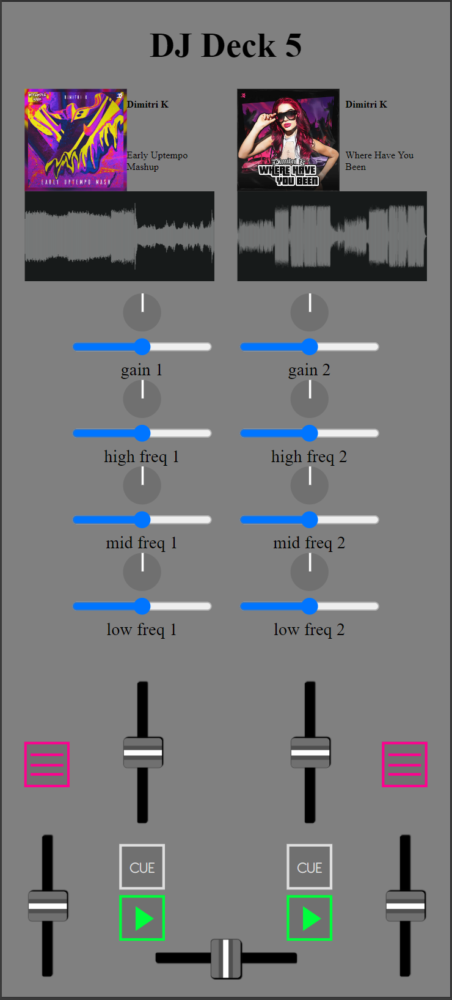

Met grid:


Waar ik tegen aan loop is natuurlijk het gebrek aan ruimte, wat erg te zien is bij de cover art, artiest en titel van de liedjes. Het lijkt allemaal erg klein en de tekst is waarschijnlijk ook voor de meesten onleesbaar. Hier moet ik nog even wat op bedenken. Verder loop ik er tegen aan dat ik twee menutjes wil maken waar tracks in staan, één menu voor channel 1 en één menu voor channel 2. Het probleem is echter dat ik niet wil dat ze beiden tegelijk geopend kunnen worden, omdat het anders een warboel kan worden. Nou heb ik het wel voor elkaar gekregen dat als het menu voor channel 1 is geopend, de menuknop voor channel 2 op display: none; komt te staan. Maar dit kan ik tot op heden niet andersom maken vanwege de volgorde van de HTML. Ik heb namelijk de volgende code gebruikt:

```css

#trackMenuButton-1:has(input[type=checkbox]:checked) + #trackMenuButton-2:has(input[type=checkbox]) {
    display: none;
}
```

Het kan zijn dat ik het weghalen van de menu knop van channel 2 weglaat, omdat het naar mijn mening het design minder goed maakt wanneer er maar één van de twee knoppen kan verdwijnen.

### 16-03-2024

Ik heb het menu voor de tracks werkend gekregen.


Hiervoor heb ik het volgende CSS formaat gebruikt:

```css
fieldset:has(fieldset label:nth-of-type(1) input[type="radio"]:checked) ~ fieldset:nth-of-type(2) {
    display: grid;
}
```

Wanneer er een track aan de linkerkant wordt geselecteerd, zal de track ‘geplaatst’ worden in de DJ deck en is deze klaar om ‘af te spelen’. Dit geldt ook voor de tracks aan de rechterkant. De linkerkant staat voor channel 1 en de rechter voor channel 2. 

Qua styling moet er nog een hoop gedaan worden, maar ik ben nu alweer een stap verder met de functionaliteiten. 

Ook heb ik nieuwe waveforms gemaakt, die transparant zijn. Dit zijn ook PNGs en kunnen beter gemanipuleerd worden qua hoogte en breedte dan SVG bestanden. Ik heb de hoogte van de waveform gekoppeld aan de volume slider en de breedte van de waveform aan de tempo slider. De tempo slider heeft nieuwe waardes gekregen om het effect van versnellen nog groter te maken. Nu ik ook de freqentie knoppen en de gain knoppen aan de waveforms heb gekoppeld kan de hoogte al helemaal goed gemanipuleerd worden

[alles max]


[alles min]

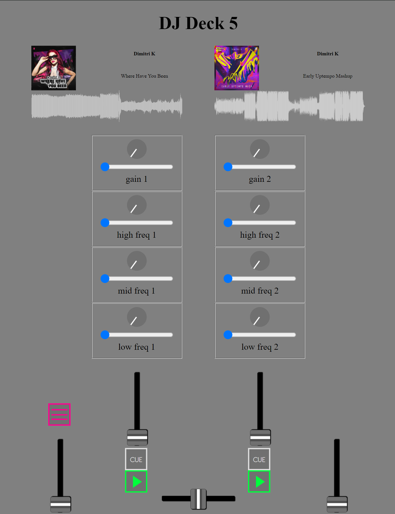

[standaard]


om de rekenen hoe hoog de waveform moet zijn wordt de volgende berekening gebruikt (natuurlijk geldt dit ook voor beide channels)

```css
height: calc(60px * calc(var(--volume1) + calc(var(--low-freq-1) * 0.05) + calc(var(--mid-freq-1) * 0.05) + calc(var(--high-freq-1) * 0.05) + calc(var(--gain-1) * 0.2)));
```

Om de effecten na te bootsen heb ik ervoor gekozen om de volume slider en de gain knop de groottste veranderingen te laten maken en de freqentie knoppen wat minder.

### 18-03-2024

Nieuwe grid layout:


Alles staat nu vast, wat het resultaat heeft dat als het menu wordt geopend, niet alle elementen alle kanten op vliegen. Dit heb ik gedaan door i.p.v. overal 1fr te gebruiken, de kolommen en rijen specifiekere waardes te geven. Nu moet ik nog het trackmenu beter maken. Daarna is de mobile view als het ware af en kan ik een begin maken aan de web view.

De draaitafel ziet er nu als volgt uit:


Ik heb het grid aangepast, zodat bepaalde elementen een vaste waarde hebben, zoals het de tracks, waveforms, de draaiknoppen en het menu. Hierdoor verandert er geen één positie wanneer het menu wordt geopend en ziet het er beter uit. Ik heb ook extra liedjes toegevoegd, die elk in het bijbehorende channel kunnen worden geplaatst.

Ik heb nu per liedje de waveform ‘meegegeven’. Ik heb hiervoor het stukje code dat gebruikt wordt om de tracks in de channels te zetten gekopiëerd en geplakt, met alleen andere waardes bij de fieldset.


code voor het ‘inladen’ van een liedje:

```css
fieldset:has(fieldset label:nth-of-type(1) input[type="radio"]:checked) ~ fieldset:nth-of-type(2) {
    display: grid;
}
```

code voor het ‘inladen’ van het bijbehorende waveform:

```css
fieldset:has(fieldset label:nth-of-type(1) input[type="radio"]:checked) ~ fieldset:nth-of-type(18) {
    display: grid;
}
```

De img moet in een fieldset staan om het scrollbaar te maken en voor de juiste positie wat tevens ook als ‘viewbox’ wordt gebruikt.

Alle waveforms toegevoegd en werkend met de radio buttons in het menu:


### 19-03-2024
Ik heb een animatie gemaakt voor de cue en start knoppen waardoor het lijkt alsof het liedje wordt afgespeeld. Hiervoor heb ik twee animaties gemaakt die hetzelfde zijn, alleen wordt de ene animatie gebruikt voor de cue knop en de andere voor de start knop. De reden hiervoor is dat bij de cue knop animatie de animatie opnieuw moet beginnen wanneer de checkbox niet meer checked is en bij de start knop animatie moet de animatie doorgaan wanneer de checkbox niet meer checked (pauze) is. ([bron](https://css-tricks.com/how-to-play-and-pause-css-animations-with-css-custom-properties/))

```css
/* ANIMATION FOR CUE BUTTON - CHANNEL 1 */
body main:has(#cue1 input[type="checkbox"]:checked) > fieldset #waveform-test-1 {
    animation-name: playingTrackCue;
    animation-duration: 10s;
    animation-play-state: running;
}

/* ANIMATION FOR CUE BUTTON - CHANNEL 2 */
body main:has(#cue2 input[type="checkbox"]:checked) > fieldset #waveform-test-2 {
    animation-name: playingTrackCue;
    animation-duration: 10s;
    animation-play-state: running;
}

/* ANIMATION FOR START BUTTON - CHANNEL 1 */
body main:has(#start1 input[type="checkbox"]:checked) > fieldset #waveform-test-1 {
    animation-play-state: running;
}

/* ANIMATION FOR START BUTTON - CHANNEL 2 */
body main:has(#start2 input[type="checkbox"]:checked) > fieldset #waveform-test-2 {
    animation-play-state: running;
}

#waveform-test-1 {
    height: calc(60px * calc(var(--volume1) + calc(var(--low-freq-1) * 0.05) + calc(var(--mid-freq-1) * 0.05) + calc(var(--high-freq-1) * 0.05) + calc(var(--gain-1) * 0.2)));
    width: calc(100% * var(--tempo1, .1));
    position: relative;
    animation-name: playingTrackStart;
    animation-duration: 10s;
    animation-play-state: paused;
}

#waveform-test-2 {
    height: calc(60px * calc(var(--volume2) + calc(var(--low-freq-2) * 0.05) + calc(var(--mid-freq-2) * 0.05) + calc(var(--high-freq-2) * 0.05) + calc(var(--gain-2) * 0.2)));
    width: calc(100% * var(--tempo2, .1));
    position: relative;
    animation-name: playingTrackStart;
    animation-duration: 10s;
    animation-play-state: paused;
}
```

Ik heb voor de webview twee track menu’s toegevoegd, één voor channel 1 en één voor channel 2. Dit is een ander menu dan voor de mobile view, omdat dat één menu is voor beide channels. Hiervoor heb ik alle benodigde HTML en CSS moeten dupliceren en omzetten naar iets dat voor de web view past. Door het toevoegen van deze twee menu’s moest ik ook de CSS voor de mobile view van het menu aanpassen.

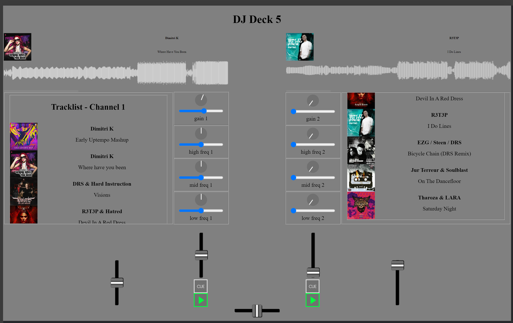

### 20-03-2024
Ik heb fonts toegevoegd voor h1, h2, p en label. Voor h1 heb ik honk gebruikt en voor de overige elementen een variatie van Avenir. 

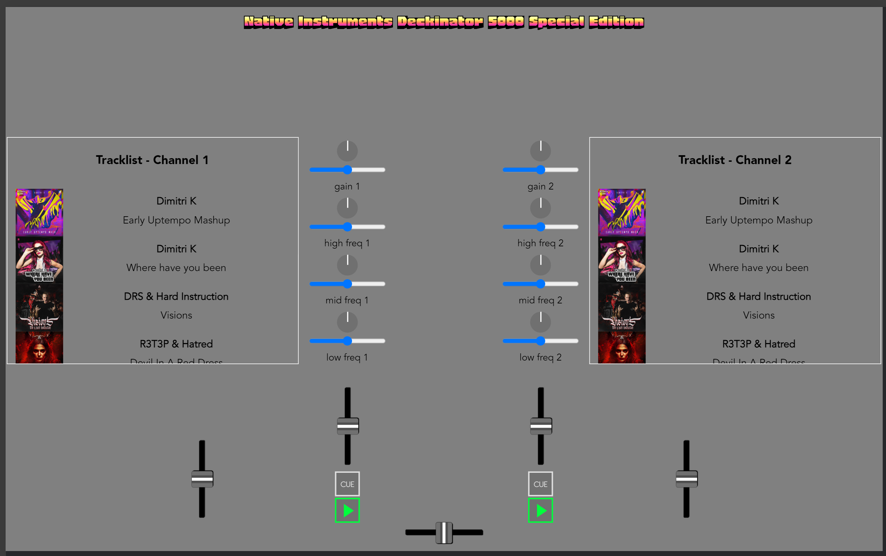

Ook heb ik schaalbare font-sizes gespecificeerd:

```css
h1 {
    font-family: honk;
    font-size: clamp(1rem, 1.529vw + 0.5rem, 2.5rem);
    margin: 0px;
    align-self: center;
}

h2 {
    font-family: avenirBlack;
    font-size: clamp(0.667rem, 1.146vw + 0.533rem, 1.267rem)
}

p {
    font-family: avenirBook;
    font-size: clamp(0.625rem, 0.637vw + 0.486rem, 1.25rem);
}

label {
    font-family: avenirBook;
}
```

Verder heb ik op basis van de feedback van Sanne delen van de CSS aangepast. Zo heb ik bijna alle fieldsets vervangen voor divs, brs en ids weggehaald bij de volume knoppen, dubbele CSS in één class gezet, gebruikte kleuren als root element gezet en b vervangen voor strong. Tenslotte heb ik een eindevaluatie geschreven van de opdracht.